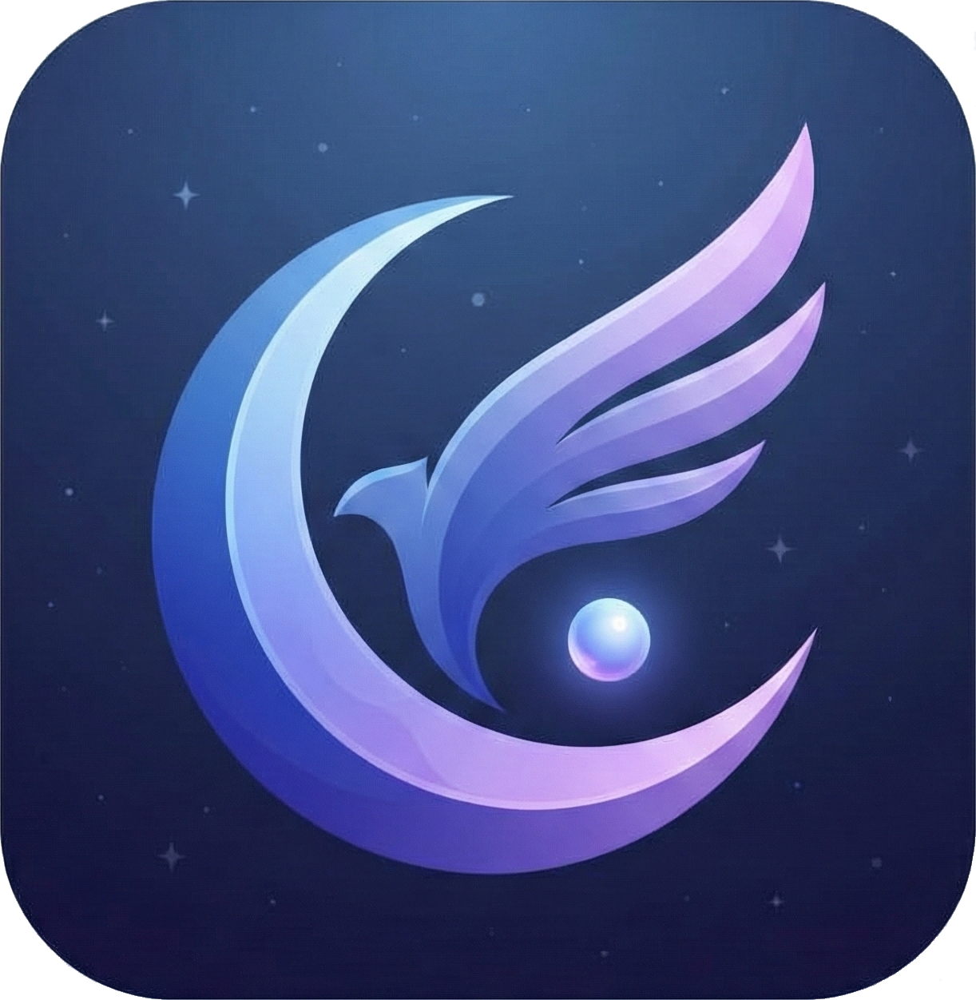
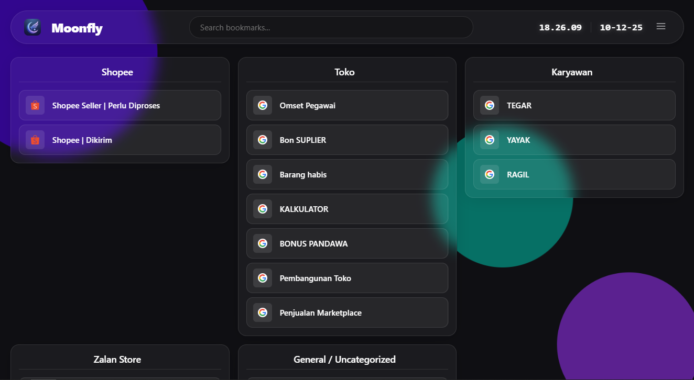
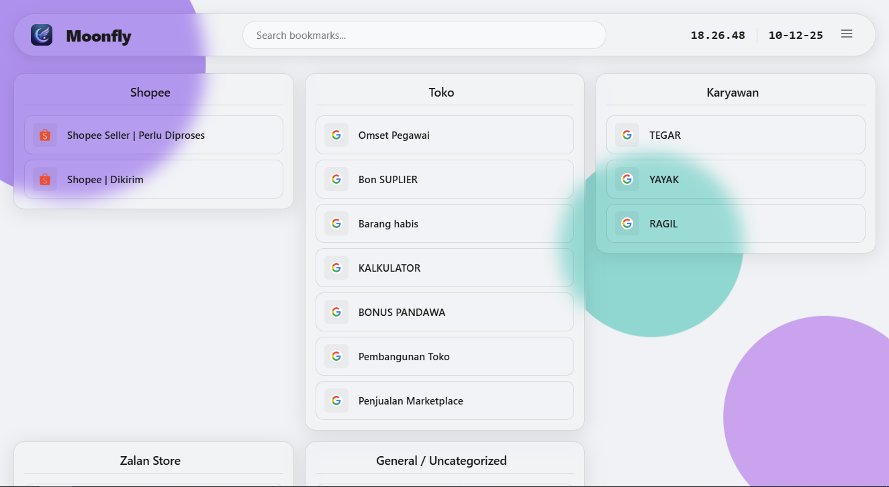

<p align="center">
  
</p>

# Moonfly
<p style="text-align: center;">Beautiful Bookmark Manager on New Tab</p>


<br><br>

<br><br>

[🇮🇩 Bahasa Indonesia](#bahasa-indonesia) | [🇬🇧 English](#english)

## Bahasa Indonesia

### 📖 Tentang# Moonfly 🌙 (v1.2)

> **Moonfly** adalah ekstensi Chrome "New Tab" yang minimalis, aesthetic, dan fungsional. Mengubah halaman tab baru yang membosankan menjadi dashboard produktivitas yang cantik.ndah dan fungsional. Dengan desain glassmorphism yang modern dan fitur-fitur canggih, Moonfly membuat pengelolaan bookmark menjadi pengalaman yang menyenangkan.

### ✨ Fitur Utama

#### 🎨 Kustomisasi Visual
- **6 Tema Warna Aksen**: Purple, Blue, Green, Pink, Orange, Red
- **Premium Light & Dark Modes**: Tampilan glassmorphism kelas atas (iOS-style) di kedua mode
- **Advanced Appearance**: Atur Radius, Opacity, dan Blur sesuka hati untuk setiap elemen
- **Animasi Smooth**: Sliding pill indicator dan transisi yang halus
- **Background Orbs**: Efek visual yang dinamis dan menarik

#### 📚 Manajemen Bookmark
- **Drag & Drop**: Atur ulang bookmark dan kategori dengan mudah
- **2 Mode Tampilan**: Card View (grid) dan Column View
- **Edit/Delete On Hover**: Tombol aksi muncul saat hover untuk UX yang clean
- **Search Functionality**: Cari bookmark dengan cepat
- **Perataan Judul**: Atur posisi judul kategori (Kiri/Tengah/Kanan)

#### ⚙️ Pengaturan Fleksibel
- **Lock Mode**: Kunci layout untuk mencegah perubahan tidak sengaja
- **Show/Hide Tooltips**: Toggle tampilan tooltip bookmark
- **Clock & Date Display**: Tampilkan waktu dan tanggal real-time
- **Adjustable Columns**: Atur jumlah kolom (1-5) di Column View
- **Import/Export**: Backup dan restore bookmark Anda

#### 🔄 Sinkronisasi
- **Chrome Sync**: Pengaturan tersinkronisasi otomatis antar device
- **Real-time Updates**: Perubahan langsung terlihat tanpa refresh

### 🚀 Instalasi

1. **Download Extension**
   - Clone repository ini atau download sebagai ZIP
   ```bash
   git clone https://github.com/yourusername/moonfly.git
   ```

2. **Load ke Chrome**
   - Buka `chrome://extensions/`
   - Aktifkan "Developer mode" (toggle di kanan atas)
   - Klik "Load unpacked"
   - Pilih folder Moonfly

3. **Selesai!**
   - Buka New Tab untuk melihat Moonfly

### 📖 Cara Penggunaan

#### Menambah Kategori
1. Klik tombol menu (☰) di kanan atas
2. Klik tombol "+" (Add Category)
3. Masukkan nama kategori
4. Klik "Add"

#### Mengedit/Menghapus Bookmark
1. Hover di bookmark card
2. Tombol Edit (✏️) dan Delete (🗑️) akan muncul di pojok kanan atas
3. Klik tombol yang diinginkan

#### Mengatur Tampilan
1. Buka menu (☰)
2. Pilih mode tampilan: Card atau Column
3. Atur jumlah kolom (untuk Column View)
4. Pilih perataan judul kategori

#### Mengganti Tema Warna
1. Buka menu (☰)
2. Scroll ke "Accent Color"
3. Klik salah satu kotak warna
4. Tema akan berubah otomatis

### 🎯 Keyboard Shortcuts

- `Ctrl + K` atau `Cmd + K`: Focus ke search bar
- `Esc`: Tutup modal/menu

### 🛠️ Teknologi

- **HTML5**: Struktur semantic
- **CSS3**: Glassmorphism, CSS Variables, Flexbox, Grid
- **Vanilla JavaScript**: Tanpa framework untuk performa optimal
- **Chrome Extension API**: Bookmarks API, Storage Sync API

### 📝 Changelog

#### v1.1.0 (2025-12-10) - Premium Upgrade
- 🎨 **Premium Aesthetic**: Renovasi total Light Mode & Dark Mode (iOS Glass Style)
- 🎛️ **Advanced Controls**: Slider baru untuk mengatur Radius, Opacity, dan Blur
- 📦 **Boxed Layout**: Menu kontrol yang lebih rapi dan terorganisir
- 🌓 **Dark Mode Equality**: Peningkatan kualitas visual Dark Mode setara Light Mode
- ⚡ **Performance**: Optimasi rendering dan transisi

#### v1.0.0 (2025-12-10)
- ✨ Initial release
- 🎨 6 accent color themes
- 📚 Drag & drop bookmark management
- 🔄 Chrome sync support
- 🎯 Hover-to-show action buttons
- ⚡ Sliding pill indicator animation

### 🤝 Kontribusi

Kontribusi selalu diterima! Silakan:
1. Fork repository
2. Buat branch fitur (`git checkout -b feature/AmazingFeature`)
3. Commit perubahan (`git commit -m 'Add some AmazingFeature'`)
4. Push ke branch (`git push origin feature/AmazingFeature`)
5. Buat Pull Request

### 📄 Lisensi

Didistribusikan di bawah Lisensi MIT. Lihat `LICENSE` untuk informasi lebih lanjut.

### 👤 Penulis

**Mighty Nievl**
- GitHub: [Mighty Nievl](https://github.com/Mighty-Nievl)

### 🙏 Penghargaan

- Terinspirasi dari tren desain web modern
- Ikon dari Feather Icons
- Font: Inter dari Google Fonts

---

## English

### 📖 About Moonfly

Moonfly is a Chrome extension that transforms your New Tab page into a beautiful and functional bookmark manager. With modern glassmorphism design and advanced features, Moonfly makes bookmark management a delightful experience.

### ✨ Key Features

#### 🎨 Visual Customization
- **6 Accent Color Themes**: Purple, Blue, Green, Pink, Orange, Red
- **Premium Light & Dark Modes**: High-end glassmorphism (iOS-style) in both modes
- **Advanced Appearance**: Customize Radius, Opacity, and Blur to your liking
- **Smooth Animations**: Sliding pill indicator and fluid transitions
- **Background Orbs**: Dynamic and attractive visual effects

#### 📚 Bookmark Management
- **Drag & Drop**: Easily rearrange bookmarks and categories
- **2 View Modes**: Card View (grid) and Column View
- **Edit/Delete On Hover**: Action buttons appear on hover for clean UX
- **Search Functionality**: Quickly find bookmarks
- **Title Alignment**: Adjust category title position (Left/Center/Right)

#### ⚙️ Flexible Settings
- **Lock Mode**: Lock layout to prevent accidental changes
- **Show/Hide Tooltips**: Toggle bookmark tooltip display
- **Clock & Date Display**: Show real-time clock and date
- **Adjustable Columns**: Set column count (1-5) in Column View
- **Import/Export**: Backup and restore your bookmarks

#### 🔄 Synchronization
- **Chrome Sync**: Settings automatically synced across devices
- **Real-time Updates**: Changes visible immediately without refresh

### 🚀 Installation

1. **Download Extension**
   - Clone this repository or download as ZIP
   ```bash
   git clone https://github.com/yourusername/moonfly.git
   ```

2. **Load into Chrome**
   - Open `chrome://extensions/`
   - Enable "Developer mode" (toggle in top right)
   - Click "Load unpacked"
   - Select the Moonfly folder

3. **Done!**
   - Open a New Tab to see Moonfly

### 📖 Usage Guide

#### Adding Categories
1. Click menu button (☰) in top right
2. Click "+" button (Add Category)
3. Enter category name
4. Click "Add"

#### Editing/Deleting Bookmarks
1. Hover over bookmark card
2. Edit (✏️) and Delete (🗑️) buttons will appear in top-right corner
3. Click desired button

#### Adjusting Display
1. Open menu (☰)
2. Select view mode: Card or Column
3. Adjust column count (for Column View)
4. Choose category title alignment

#### Changing Color Theme
1. Open menu (☰)
2. Scroll to "Accent Color"
3. Click any color swatch
4. Theme changes automatically

### 🎯 Keyboard Shortcuts

- `Ctrl + K` or `Cmd + K`: Focus search bar
- `Esc`: Close modal/menu

### 🛠️ Technology Stack

- **HTML5**: Semantic structure
- **CSS3**: Glassmorphism, CSS Variables, Flexbox, Grid
- **Vanilla JavaScript**: No frameworks for optimal performance
- **Chrome Extension API**: Bookmarks API, Storage Sync API

### 📝 Changelog

#### v1.2.0 (2025-12-10) - "The Premium Upgrade"
- ✨ **Donation Feature**: Added support for Saweria & GitHub Sponsors with a stunning glassmorphism modal.
- 🐉 **10-Spark Swarm Animation**: Implemented a chaotic, non-repeating "Dragon Spirit" animation system for the donation modal (with 10 independent particles).
- 💎 **Premium UI Refinement**: Overhauled Light Mode & Dark Mode with softer shadows, better contrast, and cleaner definition for all controls (toggles, sliders, inputs).
- 🦶 **Branded Footer**: Added app version and author info to the sidebar menu.
- 🔧 **Under-the-hood**: Cleaned up assets and resolved class name conflicts.

#### v1.0.0 (2025-12-10)
- ✨ Initial release
- 🎨 6 accent color themes
- 📚 Drag & drop bookmark management
- 🔄 Chrome sync support
- 🎯 Hover-to-show action buttons
- ⚡ Sliding pill indicator animation

### 🤝 Contributing

Contributions are always welcome! Please:
1. Fork the repository
2. Create feature branch (`git checkout -b feature/AmazingFeature`)
3. Commit changes (`git commit -m 'Add some AmazingFeature'`)
4. Push to branch (`git push origin feature/AmazingFeature`)
5. Create Pull Request

### 📄 License

Distributed under the MIT License. See `LICENSE` for more information.

### 👤 Author

**Mighty Nievl**
- GitHub: [Mighty-Nievl](https://github.com/Mighty-Nievl)

### 🙏 Acknowledgments

- Inspired by modern web design trends
- Icons from Feather Icons
- Font: Inter from Google Fonts

---

<div align="center">
Made with ❤️ by Mighty Nievl
</div>
